# IBM Cloud hands-on Lab for IoT: Creating a Taxi-Simulator and Analyze data
## Steps of the Labs
* [Overview](#1-part-0)
* [Lab 1 - Create Data with Watson IoT, ObjectStorage and Node-RED](#1-part-1)
  1. [Setup the needed application and services](#1-part1-0)
      1. [Setup and configure Node-RED](#1-part1-1)
      2. [Create and bind the needed IBM Cloud services](#1-part1-2)
  2. [Configure the services and adapt the Node-RED flow](#1-part2)
      1. [Import existing Node-RED flow](#1-part2-1)
      2. [Configure Watson IoT inside the Node-RED "Configure-TaxiSimulation" Tab](#1-part2-2)
      3. [Configure the ObjectStorage Nodes inside the Node-RED "Configure-Blob for ObjectStorage" Tab and "Taxi-Simulation" Tab](#1-part2-3)
      4. [Configure the MessageHub Node inside the Node-RED "Configure-Blob for ObjectStorage" Tab](#1-part2-4)
  3. [Use the Watson IoT input in Node-RED](#1-part3)
  4. [Use the Web UI for Simulation](#1-part4)
* [Lab 2 - Analyze Data with Watson Studio](#2-part0)
  * [Analyze the IoT data with Watson Studio](#2-part1)
* [Summary](#3-part-0)
---
## Overview <a name="1-part-0"></a>

In these Labs you will create a **Taxi-Simulator** for **Watson IoT**. This Taxi-Simulator will create **sample data** for a Data Analytics part in Lab 2 of this  Hands-on Workshop.

_Note: Please use the **US-South Region** for the two Labs as the Watson Studio Services are only available there._

In the following image you can see the dependency of the two Labs.

_Note: IBM Data Science Experience has been renamed and extended. The new name is  **Watson Studio**._

a) [Lab 1 - Taxi-Simulator IoT Part on YouTube](https://youtu.be/wLHU7mRcn94)

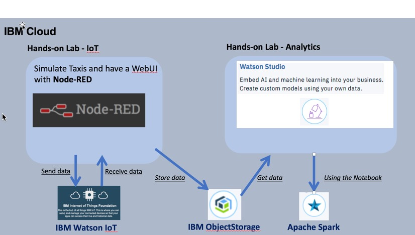

The objective of the **first Lab** is related to IoT, that means you will get a basic understanding of the IBM IoT and how to
customize your own flow in Node-RED, by using the given **IoT Data** to display in your Node-RED Dashboard UI.
The objective of the **second Lab** is to Analyze the given data using the **Watson Studio** in IBM Cloud.

---
# Lab 1 - Create Data with Watson IoT, ObjectStorage and Node-RED <a name="1-part-1"></a>

**Here are the basic use cases of the Node-RED Dashboard-UI for the first Lab**


**Functionality of the existing Node-RED flow**

1. With the taxi-simulator you can create different Taxi devices inside the Watson IoT Platform.
2. You can choose the number of taxis you want to create.
3. A created taxi will simulate speed and geolocation and the created data will be stored in a database.
4. The flow contains a dashboard UI which provides the following functionality:

    - Create sample IoT devices
    - Observe the speeding of the Taxis
    - Start and stop simulation
    - Observe the first simulated taxi and if the speeding is too high get a notification. (This will be your task to implement.)

**The first Lab contains the following steps**

*a) Setup:*
* A simulator for Taxis, sending their speed and location information.
* Setup the IBM Watson IoT

*b) Create your own Node-RED flow*
* Use Watson IoT as input in your flow
* Use the Node-RED for implementing some logic and UI

**What you will use in IBM Cloud?**

* The **Node-RED Starter** _Boiler Template_ which contains a **Cloudant DB** and a **Node.JS Server**.
* You will add additional nodes into the Node-RED instance ([Node-RED Dashboard Node](https://flows.nodered.org/node/node-red-dashboard), [Node-RED Virtual IoT Device Node](https://www.npmjs.com/package/node-red-contrib-iot-virtual-device), [Node-RED Objectstore](http://flows.nodered.org/node/node-red-contrib-objectstore) and [Node-RED MessageHub](https://flows.nodered.org/node/node-red-contrib-messagehub))
* The [Watson IoT Service](https://console.bluemix.net/catalog/services/internet-of-things-platform?env_id=ibm%3Ayp%3Aus-south)
* The [Object Store Database](https://console.bluemix.net/catalog/services/Object-Storage?env_id=ibm%3Ayp%3Aus-south)
* The [Message Hub](https://console.bluemix.net/catalog/?context=services&app=bdd3e76c-09b7-47a6-8515-50c7e6b477e9&env_id=ibm%3Ayp%3Aeu-gb&search=Message%20Hub)

---
## 1. Setup the needed application and services <a name="1-part1-0"></a>
In this part of the Lab you will setup and configure the environment we will use for your **Taxi-Simulator**.

### 1.1 Setup and configure Node-RED <a name="1-part1-1"></a>
1. Logon to your IBM Cloud Account and search the catalog for Node-RED. You will find the **Node-RED Boiler Template** and click on the icon.

    

2. Now you can see which application and services will be created. Give the application and route a name like **taxi-simulator-[YOUR-UNIQUE-NAME]**. Here you can find the **Cloudant DB** and the **Node.JS Server** and press **create**.

    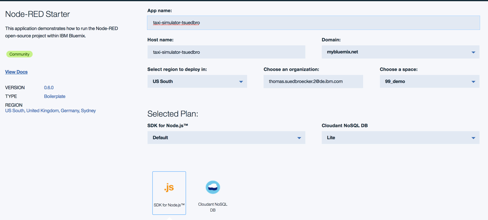

3. During testing we discovered that in some cases the service came up with errors or did not come up at all. Therefore we recommend to **stop** the service, **increase the memory to 512 MB** and **start** the service again.

    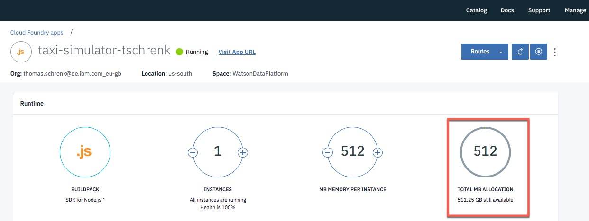

4. After this step, select **Visit App URL** to get to the Running Node-RED instance on the Node.JS Server. It might take a few minutes until the server is ready.

    

5. Now just **follow the steps in the wizard** to do the basic configuration and set a personal **password** for the Node-RED instance.

    

6. Now inspect the landing page and press **Go to your Node-RED flow editor**.

    

7. Inside Node-RED we have to add the additional _Nodes_ we will use in our future flow. (For example the [Node-RED Dashboard Package](https://flows.nodered.org/node/node-red-dashboard) and the [Node-RED Virtual IoT Device Package](https://www.npmjs.com/package/node-red-contrib-iot-virtual-device).) First select **manage palatte** from the menu on right upper side of the page.

    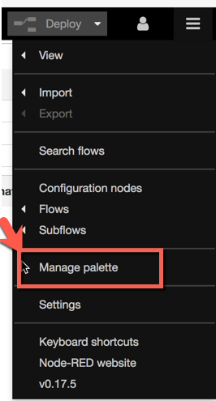

8. Now choose the Tab **install**, search and press install for each of these four nodes:
    * **node-red-dashboard**,
    * **node-red-contrib-iot-virtual-device**,
    * **node-red-contrib-objectstore**,
    * **node-red-contrib-messagehub**

    

9. After the installation, verify that the following sections for the installed nodes will appear on the left hand side.

    

---
### 1.2 Create and bind the needed IBM Cloud services <a name="1-part1-2"></a>
**Watson IoT and MessageHub**

1. Search for the Watson IoT Service by inserting **Internet of Things Platform** in the catalog search and press on the service.

    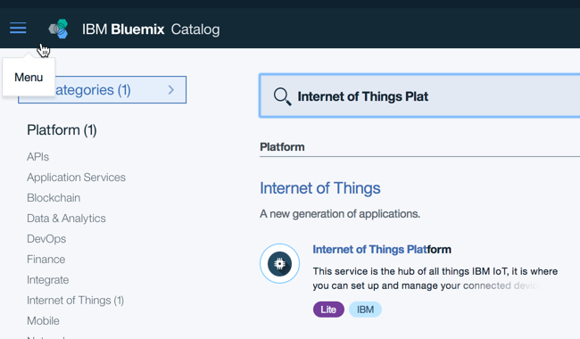

2. Go back to your IBM Cloud application and select **connections** on the left hand side and press **connect new**.

    

3. For the service name insert **taxi-simulator-InternetOfThingsPlatform** and press **create**. Do **NOT** select restage for now.

    

4. Repeat the steps 1 to 3 for the Service **MessageHub**. Name this service **taxi-simulator-MessageHub**.

---
**Cloud object storage**

1. Now open the IBM Cloud catalog directly.
   With following link: https://console.bluemix.net/catalog/infrastructure/object-storage-group

2. Search for **Cloud Object Storage** directly in the catalog and in this infrastructure component, select **Bluemix Object Storage Swift**.

   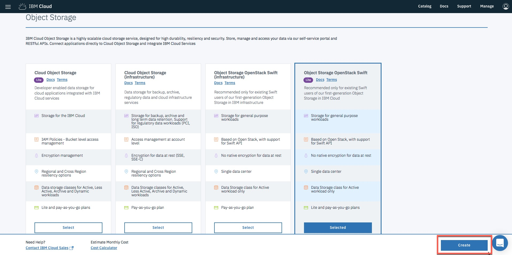

3. Name the service **taxi-simulator-ObjectStorage** and press create. _NOTE:_ You can only use **ONE** instance per **ORGANIZATION** of **Cloud Object Storage**.                     

   

4. Open the Dashboard and select your Cloud Foundry **taxi-simulation App**. Select **Connections**.

5. Select **Create Connection** and select your just created **Cloud Object Storage** service. If you are asked to restage the application, press **Restage**.

6. After these steps, you have connected services as in the following picture. In my case I have a different name for the **cloud object storage** service.                               

   

---
## 2. Configure the services and adapt the Node-RED flow <a name="1-part2"></a>

### 2.1 Import existing Node-RED flow <a name="1-part2-1"> </a>

**Copy the prepared Node-RED flow into the your Node-RED instance**

1. Open the file **[Node-RED-Flows/lab_start_20171013.json](Node-RED-Flows/lab_start_20171013.json)** in GitHub and copy all the content into the clipboard.

2. Inside Node-RED, select **Menu->Import->Clipboard**


3. Take look into the three tabs
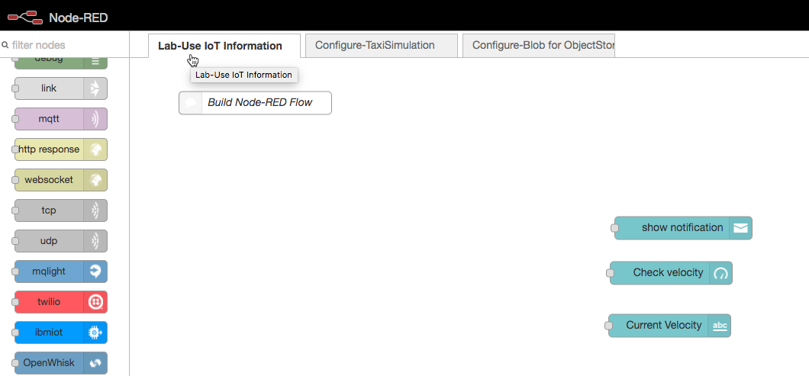

4. Press **Deploy** in the right upper corner of the Node-RED Editor page.

---
### 2.2 Configure Watson IoT inside the Node-RED "Configure-TaxiSimulation" Tab <a name="1-part2-2"></a>
Inside the **Configure-TaxiSimulation** tab you have following functionality:

1. With the taxi-simulator you can create different Taxi devices inside the Watson IoT Platform.
2. You can choose the number of taxis you want to create.
3. A created taxi will simulate speed and geolocation and the created data will be stored in a database.
4. The flow contains a dashboard UI.

---
#### 2.2.1  Watson IoT Service and Node-RED configuration
Now you will create an app API-Key inside the Watson IoT Service and add the information to the existing Node-RED flow.

1. Open the existing Watson IoT Service and press launch
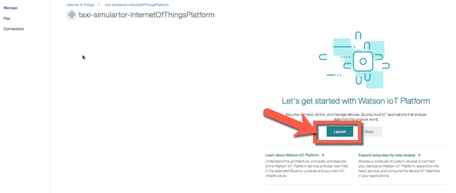

2. Create a new application API-Key inside Watson IoT by pressing **Generate API Key**

Insert **Taxi-Simulation** as Description, press **Next**.

3. Change API Role to **Backend Trusted Application** and press **Generate Key**.

  _**Note: Keep this window open** and **store API Key and Authentification Token at a safe place (e.g. copy it to another editor window and save the file.)**. You will need to insert API Key and Authentification Token in Node-RED and the Taxi Simulation at later steps. **You will not be able to see the Token again, therefore safe the values of Key and Token.**_


4. Open the Dashboard and note the value for the **Cloud Foundry Org**. This will be the value for orgid in the next step.

  **Note:** Please also add this value in your additional Editor window. So you have values for
  * **Key**,
  * **Authentification Token**
  * **Organization**

5. Open the Node-Red flow, select tab **Configure-TaxiSimulation** and double click on node **"set predefined config for Watson IoT"**.

  Insert the values for orgid, username and password.

  The value for **orgid** is the **Cloud Foundry Org** from the previous step.

  The value for **username** is the **API Key** you created two steps before.

  The value for **password** is the **Authentification Token** you  created two steps before.

  

6. The **IBM IoT** node in the tab **Configure-TaxiSimulation** might cause an error. Insert **"*"** into *Device Id* property.


7. Press **Deploy** in the right upper corner of the Node-RED Editor page. Press **Confirm Deploy**.

---
### 2.3 Configure the ObjectStorage Nodes inside the Node-RED "Configure-Blob for ObjectStorage" Tab and "Taxi-Simulation" Tab <a name="1-part2-3"></a>

You have to configure the credentials of the ObjectStorage usage inside Node-RED

1. Open the ObjectStorage node


2. Open the ObjectStorage Service in a other tab and create one service credential and name it **Taxi-Simulator-Credentials**.


3. Open the credentials with **view credentials**.

4. Go back to your Node-RED Editor page and configure the credentials. The following table illustrates the mapping.

| ObjectStorage     | Node-RED Node     |
| :------------- | :------------- |
| projectId       | Tendant Id     |
| User ID       | userId    |
| User Name      | username   |
| Password      | password   |

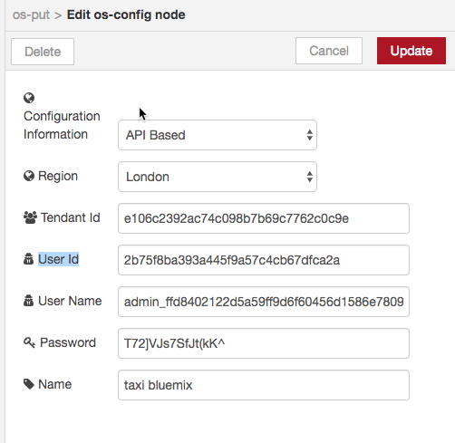


---
### 2.4 Configure the MessageHub Node inside the Node-RED "Configure-Blob for ObjectStorage" Tab <a name="1-part2-4"></a>

In this tab you can create a sample data record, which will be stored in the ObjectStorage database.
We need to insert the credentials into the node configuration.

1. Open the "MessageHub" node


2. Open the MessageHub Service, create one service credential (1) and copy the credential into the clipboard (4).


3. Copy the credentials into the open MessageHub node and press **Done**.

4. Press **Deploy** in the right upper corner of the Node-RED Editor page. Press **Confirm Deploy**.

---
## 3. Use the Watson IoT input in Node-RED <a name="1-part3"></a>

**Create your own Node-RED flow**
* Use Watson IoT as input in your flow
* Use the Node-RED for implementing some logic and UI

0. You will start with this flow                                           


1. Create IoT input node

2. Configure IoT input node.                                             


  _**Note:** With this setting **you will only get alerts for Taxi01**. If you want alerts for all Taxis please check the **All** checkbox for the **Device Id**_

3. Add debug node and make a connection to the IoT input node

4. Add a switch node

5. In the switch node, insert the string **payload.d.velocity** into "property" and add rules for >25 and <25.              


6. Create a new debug node and connect each output of the switch node.              


7. Create a new function node to build a text message in case of danger.        
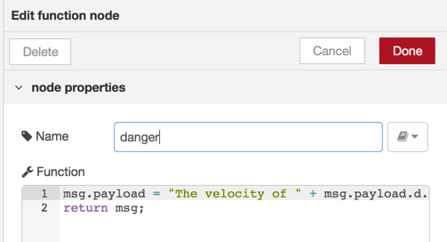
```
  // Danger
  msg.payload = "The velocity of " + msg.payload.d.velocity + " of the Taxi is to high!";
  return msg;
```

8. Create a two additional function nodes; one to build a text message in case of safe status and one to forward all data, and insert following code.          

  ```
  // All
  msg.payload = msg.payload.d.velocity;
  return msg;
  ```

  ```
  // Safe
  msg.payload = "The velocity is " + msg.payload.d.velocity + ".";
  return msg;
  ```
9. Press **Deploy** in the right upper corner of the Node-RED Editor page. Press **Confirm Deploy**

---
## 4. Use the Web UI for Simulation <a name="1-part4"></a>

1. Copy the URL of your Node-RED application and add **/ui** at the end, e.g.

      ```
      https://taxi-[YOUR_NAME].[YOUR_REGION].mybluemix.net/ui/
      ```  
    There is a menu icon in the upper left corner of the UI, please use it for navigation.

2. Under **"Taxi-Sim IoT Config"**, you insert:

  **IoT Username**: This is the **Key** you saved in a separate Editor, when generating the API Key in the IBM Watsopn IOT Platform Service.

  **IoT Password**: This is the **Authentification Token** you saved in a separate Editor, when generating the API Key in the IBM Watson IOT Platform Service.

  **IoT Organization**: This is the **Cloud Foundry Org** that is displayed in the Dashboard.

  **Number of Taxis**: the number of taxis you wish to simulate

  Press **"SUBMIT"** to start the simulation. It will take some time and a voice will tell you when the Taxis start.

3. Under **"Taxi-Sim Status"**, you can see the status of your current simulation. There are three graphs showing the velocity over time for taxi 01 and 02 and the average for all taxis.

    To stop the simulation, press **"Turn off Taxi-Simulation"**. To restart a simulation of 2 taxis, press **"Turn on Taxi Simulation (2 Taxis)"**

    

4. Under **"Taxi-Sim IoT Output"**, you can see the result of the node-red flow you added into the *"Lab-Use IoT Information"* Tab in Step 3. The velocity of *Taxi01* is displayed and there are alerts for when the velocity is too high.
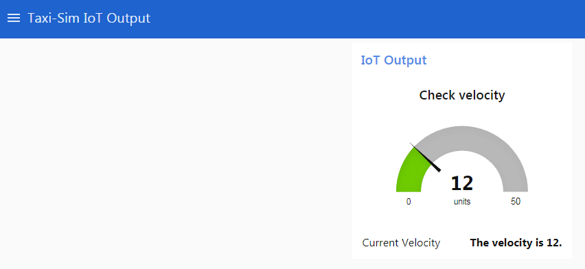

---
# Lab 2 - Analyze Data with Data Science Experience <a name="2-part0"></a>

Now you will access the created data inside the ObjectStorage and Analyze data with **Watson Studio**, by showing charts using **Pixeldust** and **Matplotlib**.

**What you will use in IBM Cloud?**

*  [Watson Studio](https://console.bluemix.net/catalog/services/data-science-experience)
* The [Apache-Spark](https://console.bluemix.net/catalog/services/apache-spark)
* Using an [Object Store Database](https://console.bluemix.net/catalog/services/Object-Storage?env_id=ibm%3Ayp%3Aus-south)

---
## Analyzing the IoT data with Watson Studio <a name="part5"></a>

1. Select the **Watson Studio** Service from the Catalog.
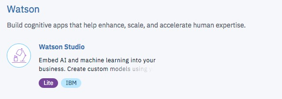

2. Name the service **taxi-simulator-WatsonStudio** or choose another name if you like.
Press **Create**.

  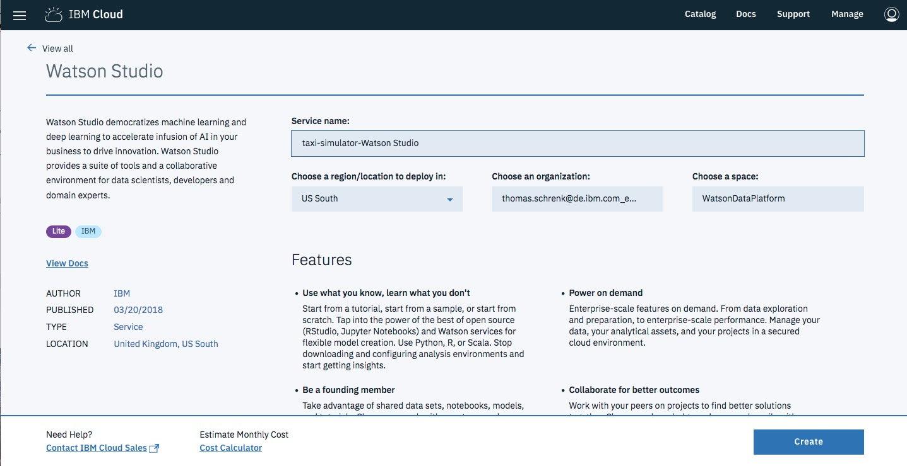

3. Open  **Watson Studio** by pressing **Get Started**.

4. When asked to select *Organization* and *Space*, verify the selection with your *Organization* and *Space* of the IoT Lab 1 and confirm the defaults, if this fits and press *continue*.

5. Create a new project by clicking **Projects**, **View all Projects** and **+ New Project** in the menu bar.

    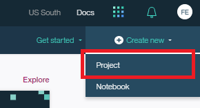  

6. Give your new project a name, for example **taxi-simulator-project**. Leave the defaults for the other configurations.

  In the right column in the Define storage service section press **Add**.

  You are going to create a new Cloud Object Storage. **Scroll down to the bottom of the page**.

  Check the **Lite** option.

  Press **Create**.

      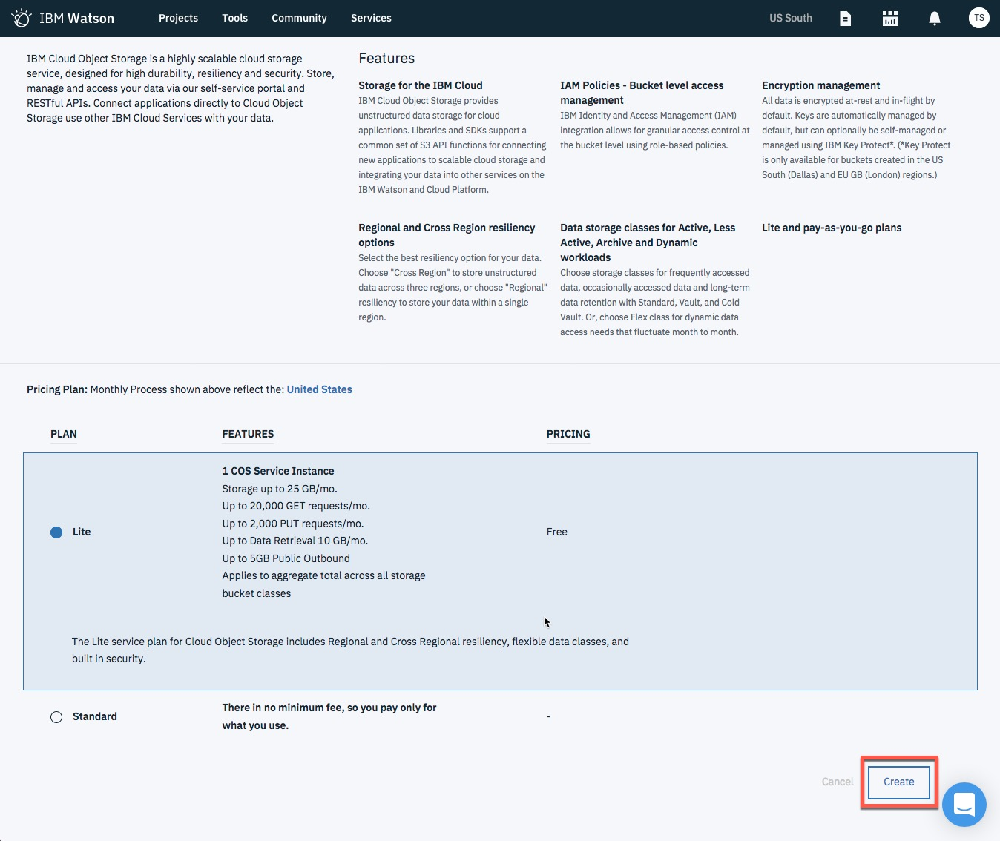      

7. In the new dialog name the service **taxi-simulator-cloud-object-storage** and press **Confirm**.
      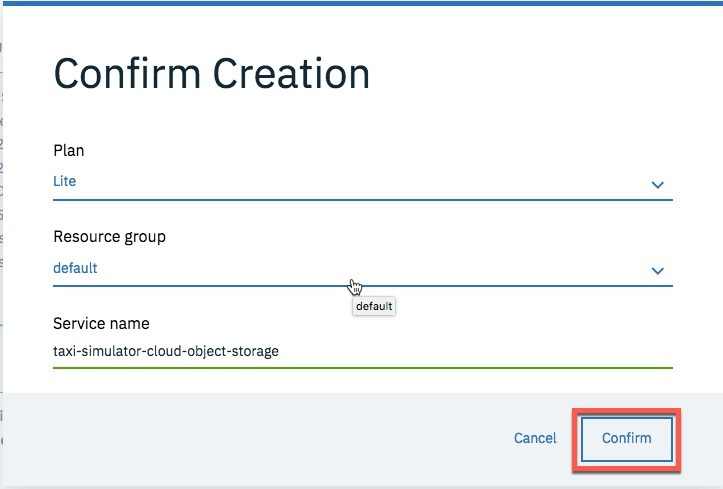
8. Back in the New project dialog press **Refresh** in the right column. You now see the created cloud storage.

  Press **Create** to create the new project.
      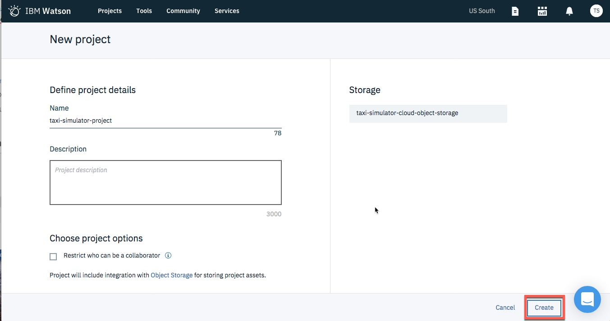

9. You have created and opened a new project. From the menu bar, select **Tools** then **Notebook**. Choose **"From File"**, name the notebook **"Taxi"** and select the file **[python-notebook/Taxi.ipynb](python-notebook/Taxi.ipynb)** . Then press **Create Notebook**.

    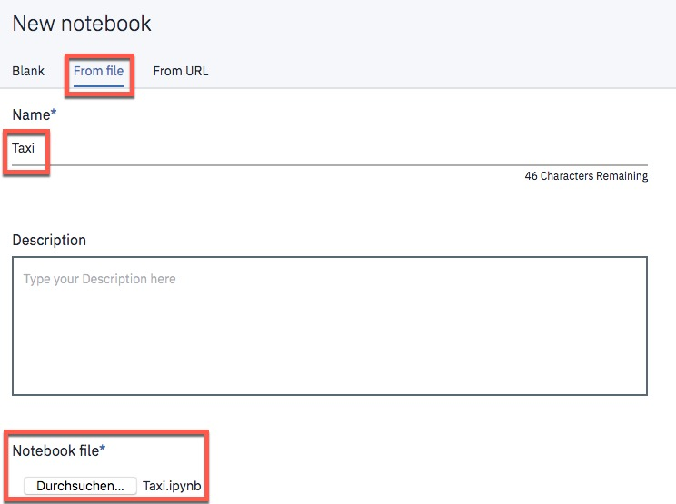

10. Follow the instructions given in the **notebook**. You will process different steps and execute code by pressing the "Play" icon in the menu bar of that window.

  You need to enter four parameters to get data from the Object Storage that can be processed

  What you need is:
  * username
  * password
  * domainId
  * file with taxi speed data

Open the **taxi-simulator-ObjectStorage** service and press **Service Credentials**, then expand **View credentials**


This is where you get the first three parameters.

  

The fourth parameter is a file of taxi simualtion data.
Press **Manage** in the menu at the left, then in the Containes section click on the container **Taxi**. You see a list of *.wav* files. T **Please pick one of the file name.**

  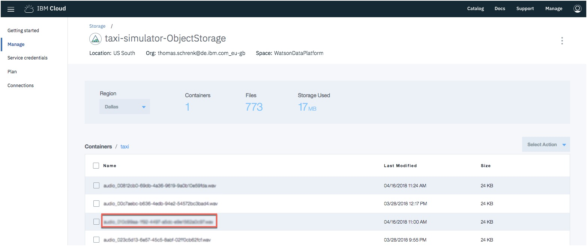  

**Note:** Though the files have the extension .wav they do not contain any sound data but the simulation data of the taxi.

*{"orgId":"org","deviceType":"Taxi","deviceId":"Taxi02","eventType":"update","timestamp":"Mon Apr 16 2018 09:23:35 GMT+0000 (UTC)","sensorData":{"location":{"longitude":-87.9,"latitude":43.03},"velocity":25}}
  {"orgId":"org","deviceType":"Taxi","deviceId":"Taxi03","eventType":"update","timestamp":"Mon Apr 16 2018 09:23:35 GMT+0000 (UTC)","sensorData":{"location":{"longitude":-95.99,"latitude":41.25},"velocity":22}}*

  Here a brief preview on the upcoming steps using **Python/Spark** inside the **Jupyter notebook**. [Link](http://jupyter.org/)
  * Preparing the environment
  * Get the data from **ObjectStorage**
  * Format the Data
  * Display data with _pixeldust_ [Link](https://developer.ibm.com/clouddataservices/2016/10/11/pixiedust-magic-for-python-notebook/)
  * Display data with _matplotlib_ [Link](https://github.com/matplotlib/matplotlib)

  1. **Pixeldust** a easy way to create and change interactive charts.

  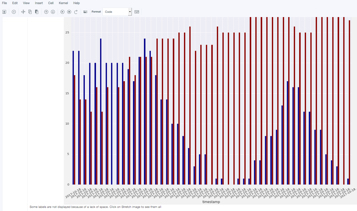

  2. **Matplotlib** using which is a Python 2D plotting library which produces publication-quality figures in a variety of hardcopy formats and interactive environments across platforms. Matplotlib can be used in Python scripts, the Python and IPython shell (à la MATLAB or Mathematica), web application servers, and various graphical user interface toolkits.

  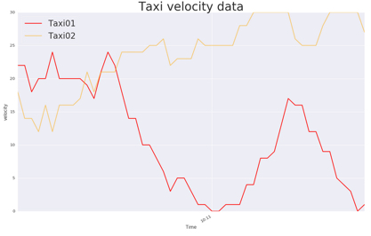

# Summary <a name="3-part0"></a>
In this lab you customized your own flow in Node-RED, visualized the **IoT Data** in your Node-RED Dashboard UI and stored the data in **Object Storage Repository**.

In the second step you analyzed the given data using the **Watson Studio** in IBM Cloud.
